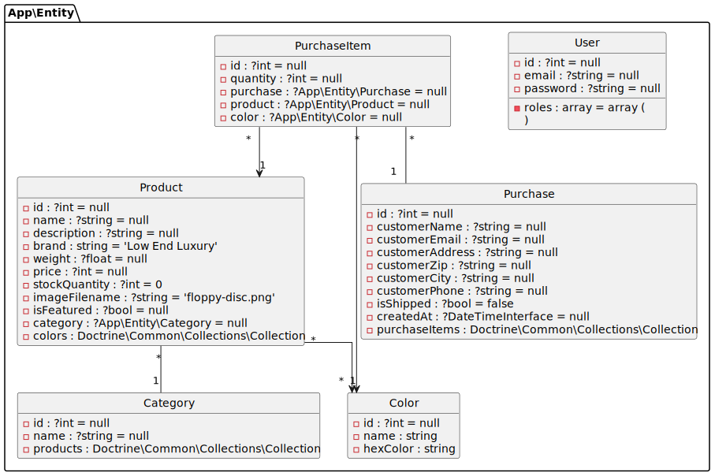

# Stimulus Tutorial (updated)

### Symfony UX: Stimulus.js 

Well hi there! This repository holds the code and script
for the [Symfony UX: Stimulus.js](https://symfonycasts.com/screencast/stimulus) course on SymfonyCasts.  It has been updated with the following:

* Update all libraries: Symfony 7, latest Bootstrap, etc.
* Replace WebpackEncore with AssetMapper
* Replace doctrine search with Meilisearch 
* Drop React (not compatible with AssetMapper)
* PostgreSQL (instead of MySQL)
* Click Me moved to the bottom of the page
* @todo: drop jQuery


## Quick Install (using sqlite)

```bash
git clone git@github.com:survos-sites/stimulus-tutorial.git && cd stimulus-tutorial 
echo "DATABASE_URL=sqlite:///%kernel.project_dir%/var/data.db" > .env.local
composer install 
symfony check:req
bin/console doctrine:database:create && bin/console doctrine:schema:update --force
bin/console doctrine:fixtures:load -n
symfony server:start -d
symfony open:local 
```

## Tests

```bash
vendor/bin/phpunit
```

## Notes

The data fixtures come from

```bash
curl 'https://dummyjson.com/products?limit=100' > src/DataFixtures/dummyproducts.json
curl 'https://dummyjson.com/products/categories?limit=100' > src/DataFixtures/dummycategories.json
```

## Database




## Setup

If you've just downloaded the code, congratulations!!

To get it working, follow these steps:

**1) Download Composer dependencies**

Make sure you have [Composer installed](https://getcomposer.org/download/)
and then run:

```
composer install
```

You may alternatively need to run `php composer.phar install`, depending
on how you installed Composer.

**2) Database Setup (with Docker)**

The easiest way to set up the database is to use the `docker-compose.yaml`
file that's included in this project. First, make sure Docker is downloaded
and running on your machine. Then, from inside the project, run:

```
docker-compose up -d
```

Congrats! You now have a database running! And as long as you use the
"symfony binary" web server (described below), the `DATABASE_URL`
environment variable will automatically be exposed to your web server:
no need to configure `.env`.

For more information about this approach, see https://symfonycasts.com/screencast/symfony5-doctrine

**2 Alternative) Database Setup (without Docker)**

If you do not want to use Docker, you can also just install and run
MySQL manually. When you're done, open the `.env` file and make any
adjustments you need - specifically `DATABASE_URL`. Or, better,
you can create a `.env.local` file and *override* any configuration
you need there (instead of changing `.env` directly).

**3) Database Schema**

To actually *create* the database and get some tables, run:

```
symfony console doctrine:database:create
symfony console doctrine:schema:update --force
symfony console doctrine:fixtures:load
```

This uses the `symfony` binary, but `symfony console` is identical
to `php bin/console`, except that this allows the `DATABASE_URL`
environment variable to be injected if you're using Docker.

If you get an error that the database exists, that should
be ok. But if you have problems, completely drop the
database (`doctrine:database:drop --force`) and try again.

**4) Start the symfony web server**

You can use Nginx or Apache, but Symfony's local web server
works even better - especially if you're using Docker for
the database.

To install the Symfony local web server, follow
"Downloading the Symfony client" instructions found
here: https://symfony.com/download - you only need to do this
once on your system.

Then, to start the web server, open a terminal, move into the
project, and run:

```
symfony serve -d
symfony open:local
```

(If this is your first time using this command, you may see an
error that you need to run `symfony server:ca:install` first).

## Have Ideas, Feedback or an Issue?

If you have suggestions or questions, please feel free to
open an issue on this repository or comment on the course
itself. We're watching both :).

## Thanks!

And as always, thanks so much for your support and letting
us do what we love!

<3 Your friends at SymfonyCasts

## Dev

composer config repositories.meili '{"type": "vcs", "url": "git@github.com:tacman/meilisearch-symfony.git"}'
composer config repositories.meili '{"type": "path", "url": "/home/tac/g/tacman/meilisearch-symfony"}'
